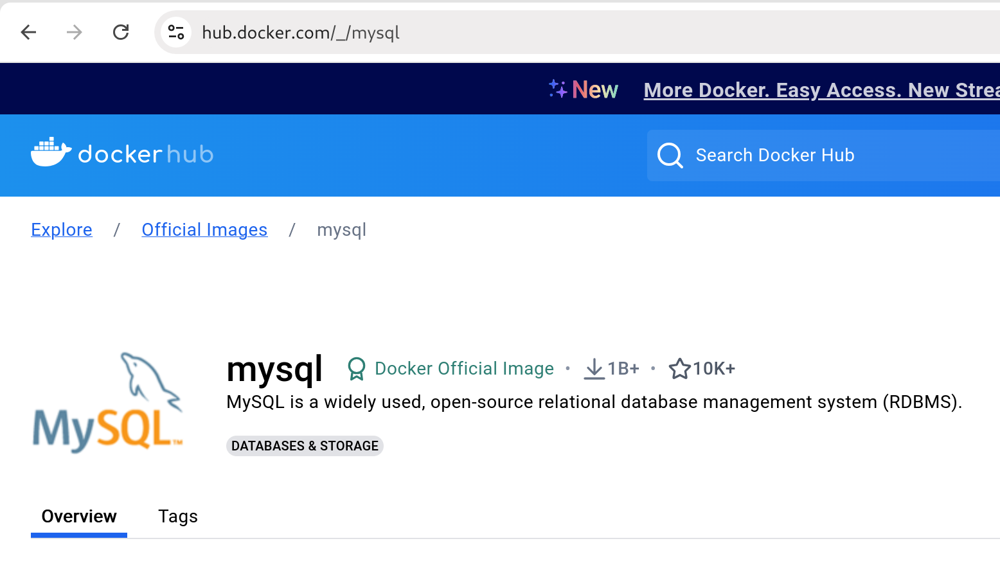

# 1. A Container is a Process in a Sandbox

Think of a container as a process (one software program) with a different
filesystem.

--

Everything in Linux is a file, that makes things easy.

<!--
With some clever handling of this (network,
devices, access rights), you can run a process in a different (linux)
environment on your local machine (Mac OSX uses virtual machines with Linux as
the guest OS).
-->

# 1.1 Change Root Directory

```sh
$ man chroot # run [...] with special root directory
```

# 1.2 Container aka Process

```sh
$ man ps # report snapshot of current processes
$ docker ps # list containers
$ podman ps # list containers
```

# 2. One Container, One Process

Run **one** process only.

--

Storage is cheap, there is no reason to run webserver, application and database
in the same container.

# 3. `podman` for User Level Containers

Use [podman](https://podman.io/) instead of docker.

```sh
$ podman help # same interface than docker, wow o.O
$ alias docker=podman
$ docker ps -a
```

# 4. Organize Your Containers

Have your container recipes as a **git repository** (local only or with remote).

# 4.1 Create Example

```sh
$ cat create-mysql.sh
#!/usr/bin/env bash

podman run -d --name mysql-local \
    --port 3306:3306 docker.io/library/mysql:latest
```

# 4.2 Start Example

```sh
$ cat start-mysql.sh
#!/usr/bin/env bash

podman start mysql-local
```

# 4.3 Reset Example

```sh
# remove and recreate, note that containers need
# maintenance too
$ cat reset-mysql.sh
#!/usr/bin/env bash

podman rmi -f mysql
./create-mysql.sh
```

# 5. Stick to Official Images

Don't run just any process (or container!) on your computer.
<!--
You wouldn't trust just any software to run on your computer, running a
container is no different. Note that docker runs on root-level and can cause
more damage.
-->

--

Offical images on docker hub have a special product badge, e.g.
[mysql](https://hub.docker.com/_/mysql), often an underscore `_` as author
name.

# 5.1 MySQL at Dockerhub



# 5.2 Container Image Sources

Companies like RedHat or Bitname provide well maintained and trusted images.

--

Reach out to devops or security if you want to ensure a container source is
safe.

# Summary

- Containers are **processes** in a sandbox

- Run **one process** per container
- Use `podman` instead of `docker`
- Organize your containers in a **git repository**
- Stick to **official images**

